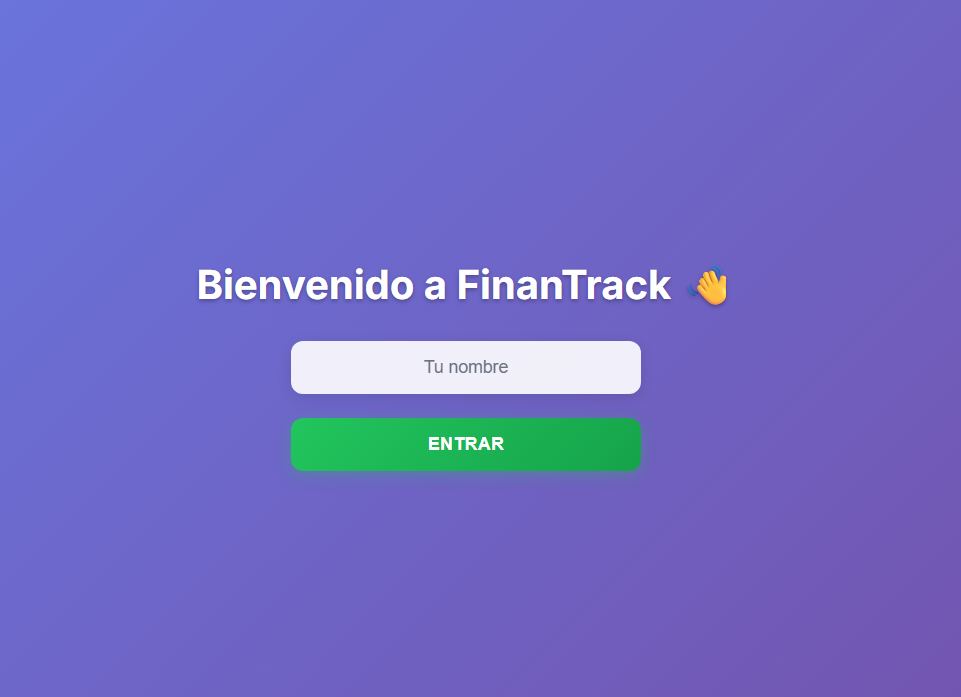
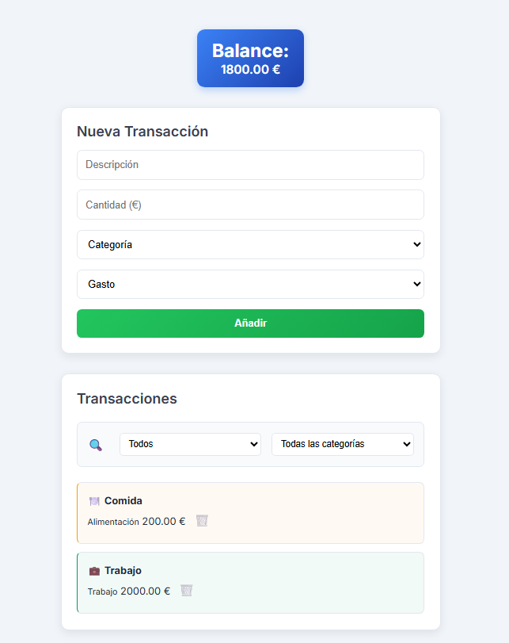
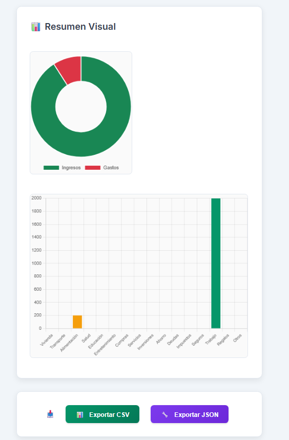

# 💰 FinanTrack

FinanTrack es una aplicación web sencilla y elegante para **gestionar tus finanzas personales**. Permite registrar ingresos y gastos, filtrarlos por categoría, ver gráficos dinámicos y exportar tus datos. Todo desde el navegador, sin necesidad de registrarse ni instalar nada.

🔗 **Demo online:** [finantrack.netlify.app](https://eloquent-queijadas-3096b5.netlify.app/)  
🧠 **Tecnologías:** HTML, CSS, JavaScript, Chart.js, localStorage  
🎯 **Estado:** Completado (v1.0)

---

## ✨ Funcionalidades principales

- ✅ Registro de ingresos y gastos
- 🔍 Filtros dinámicos por tipo y categoría
- 📈 Gráficos interactivos (doughnut + barras) con Chart.js
- 💾 Exportación a CSV y JSON
- 👤 Login de usuario (simulado, sin backend)
- 🔐 Datos separados por usuario con localStorage

---

## 📸 Capturas





---

## 🛠 Tecnologías usadas

- **HTML5 + CSS3**  
- **JavaScript (vanilla)**  
- **Chart.js** para visualización de datos  
- **localStorage** para persistencia por usuario  
- **Netlify** para despliegue

---

## 🚀 Cómo usar localmente

```bash
git clone https://github.com/RikiGuerrero/finantrack.git
cd finantrack
# Abre index.html directamente en el navegador
```

---

## 📂 Estructura del proyecto
```
.
├── LICENSE
├── README.md
├── index.html
├── screenshot
│   ├── formTransactionPage.png
│   ├── graphicsPage.png
│   └── loginPage.png
├── script.js
└── style.css
```
---

## 📬 Autor

**Ricardo Guerrero Cabrera**  
Estudiante de programación en 42 Málaga 
[LinkedIn](https://www.linkedin.com/in/ricardo-guerrero-cabrera/)

---

## 🪪 Licencia

Este proyecto está licenciado bajo la licencia [MIT](./LICENSE).  
Eres libre de usarlo, modificarlo y compartirlo siempre que mantengas el aviso de copyright.
